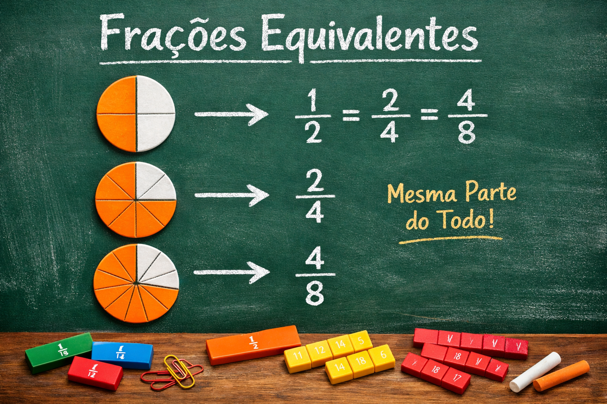
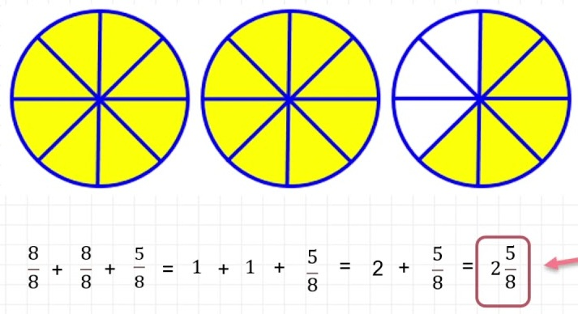

# Frações e decimais
Desenvolvido por [Viète](https://pt.wikipedia.org/wiki/Fran%C3%A7ois_Vi%C3%A8te)(1540 - 1603), o uso de vírgula para separar casas decimais. Apartir disso temos uma outra representação, as frações.
A fração representa uma divisão entre dois números. O número de cima é o **numerador**, ele representa quantas partes temos de um todo, já a parte de baixo, **denominador**, representa em quantas partes esse todo foi dividido.  

  

  

___  
## Leitura da fração
O que nomeia a fração é o seu denominador, assim, pronunciamos o numerador em sua forma cardinal e alteramos a pronúncia do denominador para sua forma fracionária.  
A partir dos denominadores maiores que 10, adicionamos a palavra “avos” ao nome do número cardinal do denominador.  
Quando o denominador é 100, o nome será o numerador seguido da palavra centésimo, e quando o denominador é 1000, da palavra milésimo.

___  
## Tipos de Fração  
### Fração própria  
O numerador é **menor** que o denominador
> Ex: 1/2 , 3/4 , 12/100
### Fração imprópria  
O numerador é **maior** que o denominador
>Ex:9/8 , 7/2 , 25/12
### Fração aparente  
Ela representa um número inteiro, ou seja, o numerador é divisível pelo denominador.  
>Ex: 2/2 = 1
### Fração equivalente  
Elas representam a mesma parte em relação ao todo, mesmo que sejam frações diferentes.  

  

### Frações irredutíveis
As frações irredutíveis são aquelas que não podem ser simplificadas pois não existe nenhum número por qual o númerador e o denominador sejam divisiveis.  
>Ex: 12/15 = 4/5, pois tanto 12 quanto 15 são divisíveis por 3.  
>4/5 é uma fração irredutível.

### Fração mista
Fração mista é uma forma de representarum número fracionário.  

    

## Operações com frações  

### Soma e Subtração:
Para somar ou subtrair frações, devemos analisar o denominador.

**Denominadores iguais:**  
Nesse caso basta ignorar os denominadores e realizar as operações entre os numeradores.  
>Ex: 1/8 + 3/8 = 4/8

**Denominadores diferentes:**  
Quando as frações têm **denominadores diferentes**, não é possível somar ou subtrair diretamente.  

**Passo a passo**  
1. Encontre um **denominador comum** (geralmente o MMC).  
2. Transforme as frações em **frações equivalentes** com esse denominador.  
3. Some ou subtraia **apenas os numeradores**.  
4. Mantenha o **denominador comum**.  
5. Simplifique o resultado, se possível.  

**Exemplo (adição)**    
>1/2 + 1/3  
>    
>MMC(2,3) = 6    
>3/6 + 2/6 = 5/6  

**Exemplo (subtração)**  
>3/4 − 1/2    
>
>MMC(4,2) = 4    
>3/4 − 2/4 = 1/4  

**Regra importante**  
Nunca some ou subtraia os **denominadores**.  

### Multiplicação e divisão  

**Multiplicação:**
Para multiplicar duas frações, multiplicamos numerador por numerador e denominador por denominador. Se puder simplifique.  
>Ex: 2/8 * 8/3 = 16/24 = 2/3  

**Divisão:**
Para dividir duas frações devemos conservar a primeira e multiplicar pelo inverso da segunda.  
>Ex: 2/7  /  6/9  = 2/7 * 9/6  =  18/42 = 3/7

## Fonte:   
>SILVA, Luiz Paulo Moreira. Fração: o que é, como ler, tipos, operações. Brasil Escola. Disponível em: https://brasilescola.uol.com.br/matematica/fracao.htm. Acesso em: 24 maio 2024.

## Exercícios:  
>https://exercicios.brasilescola.uol.com.br/exercicios-matematica/exercicios-sobre-fracoes.htm
