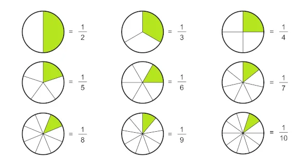

# Frações e decimais
Desenvolvido por [Viète](https://pt.wikipedia.org/wiki/Fran%C3%A7ois_Vi%C3%A8te)(1540 - 1603), o uso de vírgula para separar casas decimais. Apartir disso temos uma outra representação, as frações.
A fração representa uma divisão entre dois números. O número de cima é o **numerador**, ele representa quantas partes temos de um todo, já a parte de baixo, **denominador**, representa em quantas partes esse todo foi dividido.  

  

  
---  

## Leitura da fração
O que nomeia a fração é o seu denominador, assim, pronunciamos o numerador em sua forma cardinal e alteramos a pronúncia do denominador para sua forma fracionária.  
A partir dos denominadores maiores que 10, adicionamos a palavra “avos” ao nome do número cardinal do denominador.  
Quando o denominador é 100, o nome será o numerador seguido da palavra centésimo, e quando o denominador é 1000, da palavra milésimo.

